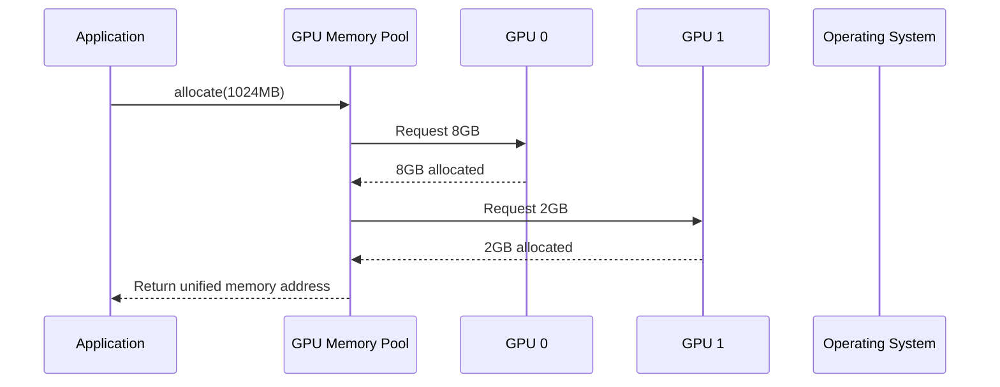

# Chapter 1: GPU Memory Pool


<think>
Okay, I need to create a beginner-friendly tutorial chapter for the "GPU Memory Pool" concept in the GMLake project. Let me start by understanding the requirements.

First, the user provided a detailed structure and context. The chapter is the first one, so no need for a transition from a previous chapter. The main goal is to explain the GPU Memory Pool concept, its purpose, and how it solves the problem of memory fragmentation in GPU usage.

The user mentioned that the chapter should start with a high-level motivation using a concrete example. Let me think of a use case. Maybe a scenario where a deep learning model requires more GPU memory than available, leading to fragmentation. The GPU Memory Pool would help by aggregating memory across devices, allowing efficient allocation.

Next, I need to break down the key concepts. The GPU Memory Pool is a global system that manages memory across multiple GPUs. It's like a shared pool, which helps in reducing fragmentation. I should explain terms like memory allocation, fragmentation, and how the pool optimizes these.

I should also mention the components like VmmSegment, PhyBlock, VirBlock, etc., but link them to their respective chapters. For example, when talking about segments, reference the next chapter on Virtual Memory Segment.

The user wants code snippets, but they need to be under 20 lines and simplified. The provided code has structures like PhyBlock and VmmSegment. I can create a minimal example showing how a PhyBlock is created and used, with comments to skip complex parts.

Internal implementation: Use a sequence diagram to show how the memory pool works. Participants could be the user, the memory pool, GPU devices, and the application. The diagram would show the user requesting memory, the pool allocating from available blocks, and managing fragmentation.

I need to ensure that all references to other chapters are properly linked. For example, when discussing virtual memory, link to the chapter on Virtual Memory Management.

Analogies are important. Maybe compare the GPU Memory Pool to a shared library where everyone can borrow books (memory) without worrying about where they are stored. This helps beginners relate to the concept.

The conclusion should summarize the chapter and transition to the next chapter on Caching Allocator. Make sure the tone is welcoming and easy to understand.

Now, structuring the Markdown content. Start with the heading, then the motivation, key concepts, usage example, code snippets with explanations, internal implementation with a sequence diagram, and a conclusion linking to the next chapter.

Check for any code blocks to keep under 20 lines. The example code for PhyBlock and VmmSegment should be simplified, with comments explaining the main parts without getting into the details.

Make sure to use mermaid diagrams for the sequence diagram. Also, use the correct file links for other chapters when needed.

Finally, ensure that the language is simple and avoids jargon, using analogies and examples throughout to aid understanding.
</think>

# Chapter 1: GPU Memory Pool

## Why GPU Memory Pools Matter

Imagine you're hosting a party and need to manage a shared kitchen. If everyone grabs ingredients randomly, you'll end up with wasted space and messy organization. This is what happens with GPU memory when programs request memory without coordination.

**Problem**: Deep learning models often need more GPU memory than a single GPU can provide. When programs request memory in a haphazard way, it creates **memory fragmentation**—like having gaps between kitchen shelves that make it hard to store large items.

**Solution**: A GPU Memory Pool acts like a smart kitchen organizer. It manages memory across multiple GPUs, ensuring efficient allocation and reuse. This lets you run bigger models without needing more physical GPU memory.

## What is a GPU Memory Pool?

A GPU Memory Pool is a global system that:
- Aggregates memory from multiple GPUs
- Tracks available memory blocks
- Allocates memory efficiently
- Reduces fragmentation by reusing freed memory

Think of it like a shared memory "lake" where water (memory) can flow between different parts of the system. This allows:
- Combining non-contiguous memory blocks
- Reusing memory from different streams
- Optimizing memory usage across devices

## How It Works in Practice

Let's say we have two GPUs (GPU A and GPU B) with 8GB each. A model needs 10GB of memory. Without a memory pool, this would fail. With a memory pool, it would:
1. Allocate 8GB from GPU A
2. Allocate 2GB from GPU B
3. Combine these into a single logical block
4. Use this block for the model

This is similar to combining two water tanks to fill a larger container.

## Key Concepts

### 1. Memory Blocks
These are the basic units of memory. Each block has:
- Size (e.g., 2MB)
- Location (which GPU it's on)
- Status (free/used)

### 2. Memory Segments
A segment is a collection of blocks. Think of it as a "shelf" in the kitchen:
- Holds multiple memory blocks
- Can be split or merged
- Tracks free/used blocks

### 3. Virtual Memory
This is the logical view of memory. It abstracts the physical location:
- Provides a unified address space
- Lets programs access memory without knowing the physical location

## Using the GPU Memory Pool

Here's a simple example of how memory is allocated:

```cpp
// Request 1024MB of memory
auto pool = create_gpu_pool(1024);
void* ptr = pool->allocate(1024);
```

**What happens**:
1. The pool checks available memory across GPUs
2. It finds 8GB on GPU A and 2GB on GPU B
3. It combines these into a single logical block
4. Returns a unified memory address to the program

This is like getting a single water hose that combines water from multiple taps.

## Internal Implementation

When you call `allocate()`, here's what happens:



This shows how the pool coordinates with multiple GPUs to satisfy a memory request.

## Code Example

Here's a simplified version of how memory blocks are managed:

```cpp
struct PhyBlock {
    size_t size;       // Block size (e.g., 2MB)
    int device;        // Which GPU this block is on
    bool is_free;      // Is this block available?
    // ... other metadata ...
};
```

```cpp
// Allocate memory from the pool
void* allocate(size_t size) {
    // Find a free block of sufficient size
    for (auto& block : memory_blocks) {
        if (block.is_free && block.size >= size) {
            block.is_free = false;
            return block.address;
        }
    }
    
    // If no block found, request new memory from the GPU
    auto new_block = request_new_block(size);
    memory_blocks.push_back(new_block);
    return new_block.address;
}
```

This shows the basic logic of finding and allocating memory blocks.

## Next Steps

In the next chapter, we'll explore how the memory pool uses a **caching allocator** to further optimize memory management. [Chapter 2: Caching Allocator](02_caching_allocator_.md) will show how this system keeps recently used memory ready for quick access, like keeping frequently used tools within reach in a kitchen.

Remember: The GPU Memory Pool is like a smart assistant that helps you manage your kitchen, making it easier to cook big meals (run large models) without needing a bigger kitchen (more physical memory).

---

Generated by [AI Codebase Knowledge Builder](https://github.com/The-Pocket/Tutorial-Codebase-Knowledge)