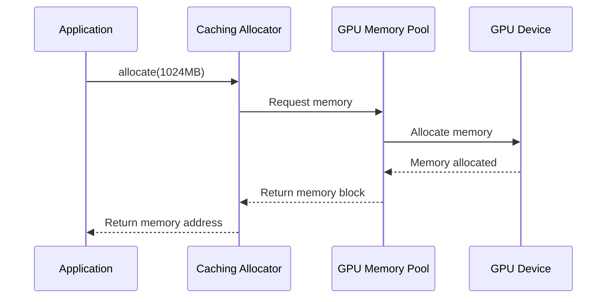

# Chapter 2: Caching Allocator


<think>
Okay, I need to create a beginner-friendly tutorial chapter for the "Caching Allocator" concept in the GMLake project. Let me start by understanding the user's requirements and the context provided.

The user has provided a structure for the tutorial chapters, and this is Chapter 2. The previous chapter is about the GPU Memory Pool, so I should start by referencing that. The main goal is to explain the Caching Allocator concept, its purpose, and how it solves memory management issues.

First, I'll need to outline the key points. The Caching Allocator is a memory management system that pre-allocates and reuses memory blocks to avoid fragmentation. It's like a memory cache. The user mentioned that GMLake improves upon this with advanced stitching techniques.

I should start with a high-level motivation using a concrete example. Maybe a scenario where a program needs frequent memory allocations, and the Caching Allocator helps by keeping frequently used blocks ready. This would relate to the previous chapter's GPU Memory Pool, which aggregates memory across GPUs.

Next, break down the key concepts. The Caching Allocator manages memory blocks, reuses them, and reduces fragmentation. I need to explain terms like memory blocks, caching, and how it's different from traditional allocators. Use analogies, like a library where books (memory) are kept ready for quick access.

Then, explain how to use the Caching Allocator. Provide a simple example, maybe a code snippet showing allocation and deallocation. Ensure the code is minimal and under 20 lines. Use comments to simplify the code and explain each part.

Internal implementation: Use a sequence diagram to show how the Caching Allocator works. Participants could include the user, the allocator, and the memory pool. The diagram should show the process of allocating memory from the cache, using it, and returning it when done.

I need to reference other chapters, like the GPU Memory Pool and Virtual Memory Management, using proper Markdown links. Make sure to link to the correct filenames and chapter titles.

Use mermaid diagrams for the sequence diagram. Keep it simple with at most 5 participants. Also, include code examples with explanations, ensuring they are beginner-friendly.

Analogies are important. Compare the Caching Allocator to a smart cache that keeps frequently used items ready, reducing the need to fetch them from slower storage. This helps beginners relate to the concept.

Finally, conclude the chapter by summarizing what was learned and transition to the next chapter, which is about GPU Virtual Memory Management. Make sure the tone is welcoming and easy to understand.

I should check that all code blocks are under 20 lines and simplified. Use comments to skip non-essential details. Ensure that the chapter flows logically from the previous one and sets up the next concepts.
</think>

# Chapter 2: Caching Allocator

## Why Caching Allocators Matter

Imagine you're running a bakery and need to manage ingredients. If you constantly ask your assistant to fetch flour from the pantry, they'll waste time searching. A **caching allocator** is like a smart kitchen assistant that keeps frequently used ingredients ready for quick access.

**Problem**: Traditional memory allocators (like `malloc`) can be slow and inefficient. They often leave gaps in memory (fragmentation) that make it hard to allocate large blocks.

**Solution**: A caching allocator pre-allocates memory and keeps it ready for reuse. This reduces the overhead of repeated allocations and minimizes fragmentation. GMLake improves this with advanced stitching techniques.

## What is a Caching Allocator?

A caching allocator is a memory management system that:
- **Pre-allocates memory blocks** in advance
- **Reuses freed memory** for future requests
- **Reduces fragmentation** by keeping memory blocks organized
- **Improves performance** by minimizing allocation overhead

Think of it like a "memory cache" that keeps recently used blocks ready for quick access. This is especially useful in GPU computing where memory is a precious resource.

## How It Works in Practice

Let's say you need to allocate memory for a deep learning model. Without a caching allocator, each allocation would require a new memory request, which is slow. With a caching allocator, it would:
1. Check if a suitable block is already available in the cache
2. If not, allocate a new block from the GPU memory pool
3. Return the block to the program

This is like having a stock of flour in a bin near the mixing station instead of always fetching from the pantry.

## Key Concepts

### 1. Memory Blocks
These are the basic units of memory. Each block has:
- Size (e.g., 2MB)
- Status (free/used)
- Location (which GPU it's on)

### 2. Cache
The cache stores recently used memory blocks. It acts as a "memory buffer" to reduce the need for repeated allocations.

### 3. Fragmentation
This occurs when memory is allocated and freed in a way that leaves small unusable gaps. A caching allocator minimizes this by reusing freed blocks.

## Using the Caching Allocator

Here's a simple example of how memory is allocated:

```cpp
// Request 1024MB of memory
auto cache = create_cache(1024);
void* ptr = cache->allocate(1024);
```

**What happens**:
1. The cache checks available memory blocks
2. It finds a suitable block (or allocates a new one)
3. Returns the block to the program

This is like asking your assistant for flour: they either hand it to you directly from the cache or fetch it from the pantry if it's not available.

## Internal Implementation

When you call `allocate()`, here's what happens:



This shows how the caching allocator coordinates with the GPU memory pool to satisfy a memory request.

## Code Example

Here's a simplified version of how memory blocks are managed:

```cpp
struct MemoryBlock {
    size_t size;       // Block size (e.g., 2MB)
    bool is_free;      // Is this block available?
    void* address;     // Physical memory address
    // ... other metadata ...
};
```

```cpp
// Allocate memory from the cache
void* allocate(size_t size) {
    // Find a free block of sufficient size
    for (auto& block : memory_blocks) {
        if (block.is_free && block.size >= size) {
            block.is_free = false;
            return block.address;
        }
    }
    
    // If no block found, allocate a new block from the GPU
    auto new_block = request_new_block(size);
    memory_blocks.push_back(new_block);
    return new_block.address;
}
```

This shows the basic logic of finding and allocating memory blocks.

## Advanced Features

GMLake's caching allocator goes further by:
- **Stitching** memory blocks to create larger contiguous regions
- **LRU-based algorithms** to prioritize reuse of frequently used blocks
- **Multi-stream support** to manage memory across different computational streams

These features help reduce fragmentation and improve memory utilization.

## Next Steps

In the next chapter, we'll explore how the caching allocator integrates with **GPU Virtual Memory Management (VMM)**. [Chapter 3: GPU Virtual Memory Management (VMM)](03_gpu_virtual_memory_management__vmm__.md) will show how this system provides a unified view of memory across multiple GPUs.

Remember: The caching allocator is like a smart assistant that helps you manage your kitchen, making it easier to prepare meals (run programs) without wasting time searching for ingredients (memory).

---

Generated by [AI Codebase Knowledge Builder](https://github.com/The-Pocket/Tutorial-Codebase-Knowledge)