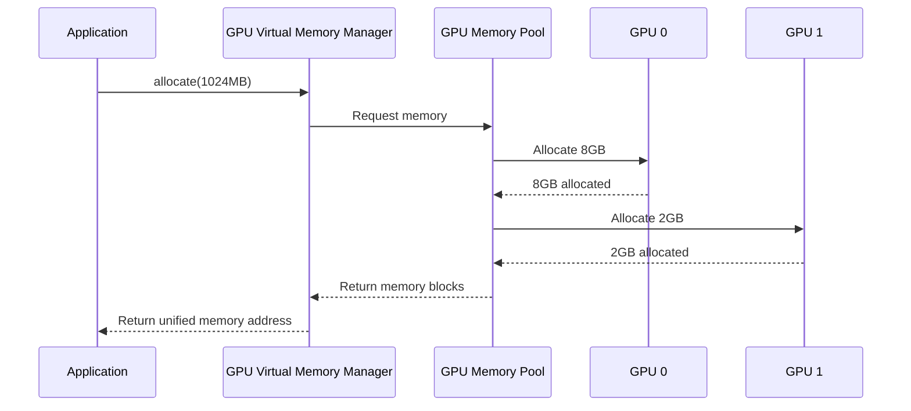

# Chapter 3: GPU Virtual Memory Management (VMM)


<think>
Okay, let's tackle this. The user wants a beginner-friendly tutorial chapter for the GMLake project's GPU Virtual Memory Management (VMM) concept. The chapter is Chapter 3, following the GPU Memory Pool and Caching Allocator chapters. 

First, I need to understand the structure and context. The previous chapters covered the GPU Memory Pool and Caching Allocator, so this chapter should build on those concepts. The main goal is to explain how VMM works, its role in memory management, and how it integrates with the previous components.

The user provided a detailed description of VMM as a "memory bridge" between physical hardware and applications, enabling optimizations like stitching, pooling, and cross-stream reuse without code changes. The chapter should explain these concepts in simple terms.

Starting with a high-level motivation: Maybe use a scenario where a program needs to use memory across multiple GPUs, and VMM helps by abstracting the physical details. This ties back to the previous chapters' concepts of memory pools and caching.

Key concepts to cover:
- VMM as a bridge between physical and virtual memory.
- Virtual Memory Segments (VmmSegment) and Physical Memory Blocks (PhyBlock).
- How VMM manages memory stitching and cross-stream reuse.
- Interaction with the Caching Allocator and GPU Memory Pool.

The user mentioned code snippets and diagrams. I need to create a simple example showing how VMM allocates memory, using the PhyBlock and VmmSegment structures. The code should be minimal, under 20 lines, with explanations.

For the internal implementation, a sequence diagram would help. Participants could include the application, VMM, GPU, and memory pool. The diagram should show the process of allocating memory through VMM.

I should reference other chapters, like the Caching Allocator and Physical Memory Block, using proper links. Analogies like a library system or a shared resource pool might help explain the concepts.

The conclusion should summarize the chapter and transition to the next chapter on Virtual Memory Segments. Ensuring the tone is welcoming and easy to understand is crucial for beginners.

Now, structuring the Markdown content with these elements in mind. Making sure each section flows logically, uses examples, and keeps the language simple. Checking that code snippets are concise and explained clearly.
</think>

# Chapter 3: GPU Virtual Memory Management (VMM)

## Why VMM Matters

Imagine you're organizing a library with books spread across multiple rooms. Without a system, finding a specific book would be chaotic. **GPU Virtual Memory Management (VMM)** is like a smart librarian that organizes memory across multiple GPUs, making it easy for programs to access memory without knowing where it's physically stored.

**Problem**: Programs often need memory from different GPUs, but managing this manually is error-prone and inefficient. Traditional methods require developers to handle memory allocation and deallocation manually, leading to complexity and potential errors.

**Solution**: VMM acts as a "memory bridge" that abstracts the physical details of memory. It allows programs to use memory seamlessly across GPUs, enabling advanced optimizations like memory stitching and cross-stream reuse without changing code.

## What is VMM?

VMM is a system that:
- **Abstracts physical memory** into a unified virtual address space
- **Manages memory across multiple GPUs** (and even CPUs)
- **Enables memory stitching** to combine non-contiguous blocks
- **Supports cross-stream reuse** of memory blocks

Think of it like a digital library where books (memory) can be accessed from any shelf (GPU) without needing to know their physical location.

## How It Works in Practice

Let's say you need to allocate memory for a deep learning model that requires 10GB. Without VMM, you'd have to manually allocate memory from each GPU, which is inefficient. With VMM, it would:
1. Check the GPU Memory Pool for available memory
2. Stitch non-contiguous blocks from different GPUs into a single logical block
3. Return a unified memory address to the program

This is like borrowing books from multiple shelves in a library and having them appear as a single collection on your desk.

## Key Concepts

### 1. Virtual Memory Segments (VmmSegment)
A VmmSegment is a logical block of memory that can span multiple physical memory blocks. It acts as a "container" for memory blocks, allowing efficient management and stitching.

### 2. Physical Memory Blocks (PhyBlock)
These are the actual memory blocks allocated on a GPU. Each block has a size, location, and status (free/used).

### 3. Memory Stitching
This is the process of combining non-contiguous memory blocks into a single logical block. It allows programs to use memory as if it were contiguous, even if it's spread across multiple GPUs.

### 4. Cross-Stream Reuse
VMM allows memory blocks to be reused across different computational streams, improving memory utilization and reducing fragmentation.

## Using VMM with the Caching Allocator

Here's a simple example of how VMM integrates with the Caching Allocator:

```cpp
// Request 1024MB of memory from the VMM
auto segment = vmm->allocate(1024);
void* ptr = segment->get_block();
```

**What happens**:
1. The VMM checks the GPU Memory Pool for available memory
2. It stitches non-contiguous blocks from different GPUs
3. Returns a unified memory address to the program

This is like asking the librarian for a book and having it appear on your desk, even if it was on multiple shelves.

## Internal Implementation

When you call `allocate()`, here's what happens:



This shows how VMM coordinates with the GPU Memory Pool to satisfy a memory request.

## Code Example

Here's a simplified version of how VMM manages memory blocks:

```cpp
struct PhyBlock {
    size_t size;       // Block size (e.g., 2MB)
    int device;        // Which GPU this block is on
    bool is_free;      // Is this block available?
    // ... other metadata ...
};

struct VmmSegment {
    std::vector<PhyBlock> phy_blocks;
    void* segment_ptr;
    size_t granul_size;
    int device_id;
    CUresult status;
    size_t free_blocks;
    size_t used_blocks;
    bool fused;
    bool released;
};
```

```cpp
// Allocate memory from the VMM
void* allocate(size_t size) {
    // Find a suitable segment in the GPU Memory Pool
    for (auto& segment : memory_segments) {
        if (segment.free_blocks > 0 && segment.granul_size >= size) {
            // Stitch non-contiguous blocks if needed
            if (segment.phy_blocks.size() > 1) {
                stitch_blocks(segment);
            }
            return segment.segment_ptr;
        }
    }
    
    // If no segment found, request new memory from the GPU
    auto new_segment = request_new_segment(size);
    memory_segments.push_back(new_segment);
    return new_segment.segment_ptr;
}
```

This shows the basic logic of finding and allocating memory blocks through VMM.

## Advanced Features

GMLake's VMM goes further by:
- **Stitching** memory blocks to create larger contiguous regions
- **LRU-based algorithms** to prioritize reuse of frequently used blocks
- **Multi-stream support** to manage memory across different computational streams

These features help reduce fragmentation and improve memory utilization.

## Next Steps

In the next chapter, we'll explore how VMM manages memory segments in detail. [Chapter 4: Virtual Memory Segment (VmmSegment)](04_virtual_memory_segment__vmmsegment__.md) will show how this system provides a unified view of memory across multiple GPUs.

Remember: VMM is like a smart librarian that helps you manage your library, making it easier to access books (memory) without needing to know where they are stored.

---

Generated by [AI Codebase Knowledge Builder](https://github.com/The-Pocket/Tutorial-Codebase-Knowledge)