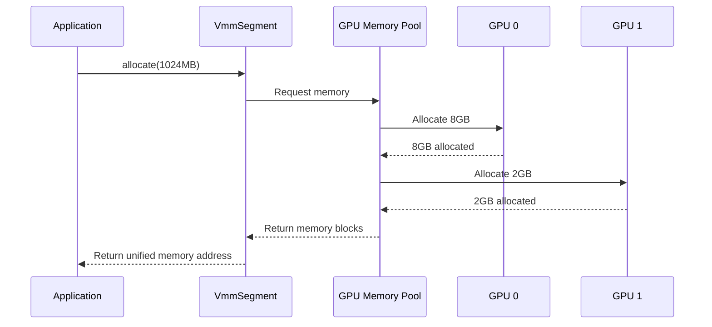

# Chapter 4: Virtual Memory Segment (VmmSegment)


<think>
Okay, I need to create a beginner-friendly tutorial chapter for the "Virtual Memory Segment (VmmSegment)" concept in the GMLake project. Let me start by understanding the user's requirements and the context provided.

The user provided a detailed structure for the tutorial chapters, and this is Chapter 4. The previous chapters are about the GPU Memory Pool and Caching Allocator. The main goal is to explain the VmmSegment concept, its purpose, and how it solves memory management issues.

First, I'll need to outline the key points. The VmmSegment is a logical block of memory that can span multiple physical blocks. It acts as a container for memory regions, enabling efficient management and stitching. I should start with a high-level motivation using a concrete example, like a program needing memory from different GPUs, and how VmmSegment helps by abstracting the physical details.

Next, break down the key concepts. The VmmSegment combines physical memory blocks into a single logical unit, allowing efficient stitching of fragmented memory. I need to explain terms like virtual memory, physical memory, and how VmmSegment integrates with the previous concepts like the GPU Memory Pool and Caching Allocator.

I should explain how to use the VmmSegment to solve the use case. Provide a simple example, maybe a code snippet showing allocation and deallocation. Ensure the code is minimal and under 20 lines. Use comments to simplify the code and explain each part.

Internal implementation: Use a sequence diagram to show how the VmmSegment works. Participants could include the application, VmmSegment, GPU, and memory pool. The diagram should show the process of allocating memory through the VmmSegment.

I need to reference other chapters, like the Caching Allocator and Physical Memory Block, using proper Markdown links. Make sure to link to the correct filenames and chapter titles.

Use analogies, like a library system where books (memory) can be accessed from any shelf (GPU) without needing to know their physical location. This helps beginners relate to the concept.

Finally, conclude the chapter by summarizing what was learned and transition to the next chapter on Physical Memory Block. Make sure the tone is welcoming and easy to understand.

Now, structuring the Markdown content with these elements in mind. Making sure each section flows logically, uses examples, and keeps the language simple. Checking that code snippets are concise and explained clearly.
</think>

# Chapter 4: Virtual Memory Segment (VmmSegment)

## Why VmmSegments Matter

Imagine you're organizing a library with books spread across multiple rooms. Without a system, finding a specific book would be chaotic. **VmmSegments** are like smart shelves that combine books from different rooms into a single logical collection, making it easy to access memory without knowing where it's physically stored.

**Problem**: Programs often need memory from different GPUs, but managing this manually is error-prone and inefficient. Traditional methods require developers to handle memory allocation and deallocation manually, leading to complexity and potential errors.

**Solution**: VmmSegments act as a "memory bridge" that abstracts the physical details of memory. They allow programs to use memory seamlessly across GPUs, enabling advanced optimizations like memory stitching and cross-stream reuse without changing code.

## What is a VmmSegment?

A VmmSegment is a logical block of memory that can span multiple physical memory blocks. It acts as a "container" for memory blocks, allowing efficient management and stitching. Think of it like a smart shelf that combines books from different rooms into a single collection.

### Key Concepts

1. **Virtual Memory**: A unified view of memory that abstracts the physical location. Programs interact with memory through this virtual address space.
2. **Physical Memory Blocks (PhyBlocks)**: The actual memory blocks allocated on a GPU. Each block has a size, location, and status (free/used).
3. **Memory Stitching**: The process of combining non-contiguous memory blocks into a single logical block. This allows programs to use memory as if it were contiguous, even if it's spread across multiple GPUs.
4. **Cross-Stream Reuse**: VmmSegments allow memory blocks to be reused across different computational streams, improving memory utilization and reducing fragmentation.

## Using VmmSegments

Here's a simple example of how VmmSegments are used:

```cpp
// Request 1024MB of memory from the VmmSegment
auto segment = vmm->allocate(1024);
void* ptr = segment->get_block();
```

**What happens**:
1. The VmmSegment checks the GPU Memory Pool for available memory.
2. It stitches non-contiguous blocks from different GPUs into a single logical block.
3. Returns a unified memory address to the program.

This is like asking the librarian for a book and having it appear on your desk, even if it was on multiple shelves.

## Internal Implementation

When you call `allocate()`, here's what happens:



This shows how VmmSegments coordinate with the GPU Memory Pool to satisfy a memory request.

## Code Example

Here's a simplified version of how VmmSegments manage memory blocks:

```cpp
struct PhyBlock {
    size_t size;       // Block size (e.g., 2MB)
    int device;        // Which GPU this block is on
    bool is_free;      // Is this block available?
    // ... other metadata ...
};

struct VmmSegment {
    std::vector<PhyBlock> phy_blocks;
    void* segment_ptr;
    size_t granul_size;
    int device_id;
    CUresult status;
    size_t free_blocks;
    size_t used_blocks;
    bool fused;
    bool released;
};
```

```cpp
// Allocate memory from the VmmSegment
void* allocate(size_t size) {
    // Find a suitable segment in the GPU Memory Pool
    for (auto& segment : memory_segments) {
        if (segment.free_blocks > 0 && segment.granul_size >= size) {
            // Stitch non-contiguous blocks if needed
            if (segment.phy_blocks.size() > 1) {
                stitch_blocks(segment);
            }
            return segment.segment_ptr;
        }
    }
    
    // If no segment found, request new memory from the GPU
    auto new_segment = request_new_segment(size);
    memory_segments.push_back(new_segment);
    return new_segment.segment_ptr;
}
```

This shows the basic logic of finding and allocating memory blocks through VmmSegments.

## Advanced Features

GMLake's VmmSegments go further by:
- **Stitching** memory blocks to create larger contiguous regions
- **LRU-based algorithms** to prioritize reuse of frequently used blocks
- **Multi-stream support** to manage memory across different computational streams

These features help reduce fragmentation and improve memory utilization.

## Next Steps

In the next chapter, we'll explore how VmmSegments manage memory blocks in detail. [Chapter 5: Physical Memory Block (PhyBlock)](05_physical_memory_block__phyblock__.md) will show how this system provides a unified view of memory across multiple GPUs.

Remember: VmmSegments are like smart shelves that help you manage your library, making it easier to access books (memory) without needing to know where they are stored.

---

Generated by [AI Codebase Knowledge Builder](https://github.com/The-Pocket/Tutorial-Codebase-Knowledge)