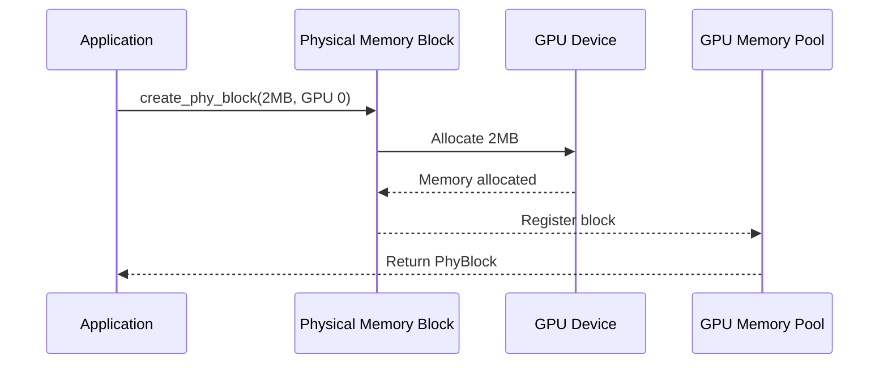

# Chapter 5: Physical Memory Block (PhyBlock)


<think>
Okay, I need to create a beginner-friendly tutorial chapter for the "Physical Memory Block (PhyBlock)" concept in the GMLake project. Let me start by understanding the user's requirements and the context provided.

The user provided a detailed structure for the tutorial chapters, and this is Chapter 5. The previous chapters are about the GPU Memory Pool, Caching Allocator, Virtual Memory Management (VMM), and Virtual Memory Segment (VmmSegment). The main goal is to explain the PhyBlock concept, its purpose, and how it solves memory management issues.

First, I'll need to outline the key points. The PhyBlock is a physical memory block allocated on a GPU, tracking size, device ID, and allocation status. It's the foundation for managing memory at the hardware level. I should start with a high-level motivation using a concrete example, like a program needing memory from a specific GPU, and how PhyBlock helps by abstracting the physical details.

Next, break down the key concepts. The PhyBlock represents a physical memory allocation, acts as a "memory brick," and tracks hardware resources. I need to explain terms like physical memory, device ID, and allocation status. Use analogies, like a brick in a wall, to make it relatable.

I should explain how to use the PhyBlock to solve the use case. Provide a simple example, maybe a code snippet showing allocation and deallocation. Ensure the code is minimal and under 20 lines. Use comments to simplify the code and explain each part.

Internal implementation: Use a sequence diagram to show how the PhyBlock works. Participants could include the application, PhyBlock, GPU, and memory pool. The diagram should show the process of allocating memory through the PhyBlock.

I need to reference other chapters, like the Caching Allocator and VmmSegment, using proper Markdown links. Make sure to link to the correct filenames and chapter titles.

Use analogies, like a brick in a wall, to explain the PhyBlock's role in memory management. This helps beginners relate to the concept.

Finally, conclude the chapter by summarizing what was learned and transition to the next chapter on Virtual Memory Block (VirBlock). Make sure the tone is welcoming and easy to understand.

Now, structuring the Markdown content with these elements in mind. Making sure each section flows logically, uses examples, and keeps the language simple. Checking that code snippets are concise and explained clearly.
</think>

# Chapter 5: Physical Memory Block (PhyBlock)

## Why PhyBlocks Matter

Imagine you're building a wall with bricks. Each brick represents a piece of memory on a GPU. A **PhyBlock** is like one of these bricks—it's a physical memory allocation that the GPU can directly access. It's the basic building block for managing memory at the hardware level.

**Problem**: Programs often need to allocate memory on specific GPUs, but managing this manually is error-prone. Traditional methods require developers to handle memory allocation and deallocation manually, leading to complexity and potential errors.

**Solution**: PhyBlocks act as "memory bricks" that track the actual hardware resources. They allow programs to use memory seamlessly across GPUs, enabling advanced optimizations like memory stitching and cross-stream reuse without changing code.

## What is a PhyBlock?

A PhyBlock is a physical memory block allocated on a GPU. It tracks:
- **Size**: How much memory the block contains (e.g., 2MB)
- **Device ID**: Which GPU this block is on
- **Allocation Status**: Whether the block is free or used

Think of it like a brick in a wall: it's a physical piece of memory that can be used to build larger structures (like virtual memory segments).

## Using PhyBlocks

Here's a simple example of how PhyBlocks are used:

```cpp
// Allocate a 2MB memory block on GPU 0
auto phy_block = create_phy_block(2 * 1024 * 1024, 0);
```

**What happens**:
1. The PhyBlock is created on GPU 0.
2. It reserves 2MB of memory.
3. The block is marked as allocated.

This is like placing a brick in a wall: you specify where it goes and how big it is.

## Internal Implementation

When you call `create_phy_block()`, here's what happens:



This shows how a PhyBlock is created and registered with the GPU memory pool.

## Code Example

Here's a simplified version of how PhyBlocks are managed:

```cpp
struct PhyBlock {
    size_t size;       // Block size (e.g., 2MB)
    int device_id;     // Which GPU this block is on
    bool is_free;      // Is this block available?
    // ... other metadata ...
};
```

```cpp
// Allocate a physical memory block
void* allocate(size_t size, int device_id) {
    // Find a suitable block in the memory pool
    for (auto& block : memory_blocks) {
        if (block.is_free && block.size >= size) {
            block.is_free = false;
            return block.address;
        }
    }
    
    // If no block found, request new memory from the GPU
    auto new_block = request_new_block(size, device_id);
    memory_blocks.push_back(new_block);
    return new_block.address;
}
```

This shows the basic logic of finding and allocating memory blocks through PhyBlocks.

## Advanced Features

GMLake's PhyBlocks go further by:
- **Stitching** memory blocks to create larger contiguous regions
- **LRU-based algorithms** to prioritize reuse of frequently used blocks
- **Multi-stream support** to manage memory across different computational streams

These features help reduce fragmentation and improve memory utilization.

## Next Steps

In the next chapter, we'll explore how PhyBlocks are used in virtual memory segments. [Chapter 6: Virtual Memory Block (VirBlock)](06_virtual_memory_block__virblock__.md) will show how this system provides a unified view of memory across multiple GPUs.

Remember: PhyBlocks are like bricks in a wall, making it easier to build larger structures (like virtual memory segments) without needing to know the physical details of each brick.

---

Generated by [AI Codebase Knowledge Builder](https://github.com/The-Pocket/Tutorial-Codebase-Knowledge)