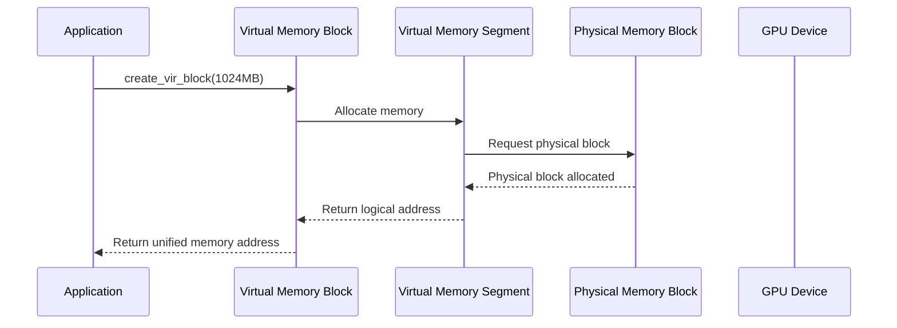

# Chapter 6: Virtual Memory Block (VirBlock)


<think>
Okay, let's tackle this. The user wants a beginner-friendly tutorial chapter for the "Virtual Memory Block (VirBlock)" concept in the GMLake project. This is Chapter 6, following the GPU Memory Pool, Caching Allocator, VMM, and VmmSegment chapters.

First, I need to understand the key points. The VirBlock is a logical memory block that maps to a physical memory region. It acts as a "memory pointer" allowing applications to access memory through virtual addresses while the system manages the underlying physical allocations. The goal is to explain this concept clearly.

Starting with a high-level motivation. Maybe use a scenario where a program needs to access memory without knowing the physical location. Compare it to a library where books are accessed by title, not shelf location.

Key concepts to cover:
- VirBlock as a logical block mapping to physical memory.
- How it abstracts physical details for applications.
- Interaction with PhyBlocks and VmmSegments.
- Use cases like memory stitching and cross-stream reuse.

The user mentioned code snippets and diagrams. I need to create a simple example showing how a VirBlock is used. The code should be minimal, under 20 lines, with comments. Use a sequence diagram to show the process of allocating a VirBlock.

Internal implementation: Explain how VirBlocks are created, mapped to physical blocks, and managed. Reference other chapters like PhyBlock and VmmSegment using proper links.

Analogies: Compare VirBlocks to a library card that points to a book's location. This helps beginners relate to the concept.

Ensure the chapter flows logically, uses examples, and keeps the language simple. Check that all references to other chapters are correct and properly linked. Conclude with a transition to the next chapter, Memory Stitching Mechanism.
</think>

# Chapter 6: Virtual Memory Block (VirBlock)

## Why VirBlocks Matter

Imagine you're in a library and want to borrow a book. Instead of searching for the physical book on a shelf, you use a library card that tells you exactly where it is. A **VirBlock** is like that library card—it's a logical pointer to a physical memory block, allowing programs to access memory without knowing its exact location on a GPU.

**Problem**: Programs often need to access memory across multiple GPUs, but managing this manually is error-prone and inefficient. Traditional methods require developers to handle memory allocation and deallocation manually, leading to complexity and potential errors.

**Solution**: VirBlocks act as "memory pointers" that abstract the physical details of memory. They allow programs to use memory seamlessly across GPUs, enabling advanced optimizations like memory stitching and cross-stream reuse without changing code.

## What is a VirBlock?

A VirBlock is a logical memory block that maps to a physical memory region. It acts as a "memory pointer" that allows applications to access memory through virtual addresses while the system manages the underlying physical allocations. Think of it like a library card: it tells you where the book (memory) is, but you don't need to know the physical shelf location.

### Key Concepts

1. **Logical Address Space**: A unified view of memory that abstracts the physical location. Programs interact with memory through this virtual address space.
2. **Physical Memory Blocks (PhyBlocks)**: The actual memory blocks allocated on a GPU. Each block has a size, location, and status (free/used).
3. **Memory Stitching**: The process of combining non-contiguous memory blocks into a single logical block. This allows programs to use memory as if it were contiguous, even if it's spread across multiple GPUs.
4. **Cross-Stream Reuse**: VirBlocks allow memory blocks to be reused across different computational streams, improving memory utilization and reducing fragmentation.

## Using VirBlocks

Here's a simple example of how VirBlocks are used:

```cpp
// Request a 1024MB VirBlock
auto vir_block = create_vir_block(1024);
void* ptr = vir_block->get_block();
```

**What happens**:
1. The VirBlock checks the GPU Memory Pool for available memory.
2. It stitches non-contiguous blocks from different GPUs into a single logical block.
3. Returns a unified memory address to the program.

This is like using a library card to find a book: you don't need to know where it is, just that it exists and how to access it.

## Internal Implementation

When you call `create_vir_block()`, here's what happens:



This shows how a VirBlock coordinates with the VmmSegment and PhyBlock to satisfy a memory request.

## Code Example

Here's a simplified version of how VirBlocks are managed:

```cpp
struct VirBlock {
    void* block_ptr;        // Logical memory address
    size_t blockSize;       // Size of the block
    std::shared_ptr<PhyBlock> phy_block;  // Underlying physical block
    int device_id;          // Which GPU this block is on
    CUresult status;        // Allocation status
    bool released;          // Whether the block is released
};
```

```cpp
// Allocate a virtual memory block
void* allocate(size_t size, int device_id) {
    // Find a suitable VmmSegment
    for (auto& segment : vmm_segments) {
        if (segment.free_blocks > 0 && segment.granul_size >= size) {
            // Stitch non-contiguous blocks if needed
            if (segment.phy_blocks.size() > 1) {
                stitch_blocks(segment);
            }
            return segment.segment_ptr;
        }
    }
    
    // If no segment found, request new memory from the GPU
    auto new_segment = request_new_segment(size);
    vmm_segments.push_back(new_segment);
    return new_segment.segment_ptr;
}
```

This shows the basic logic of finding and allocating memory blocks through VirBlocks.

## Advanced Features

GMLake's VirBlocks go further by:
- **Stitching** memory blocks to create larger contiguous regions
- **LRU-based algorithms** to prioritize reuse of frequently used blocks
- **Multi-stream support** to manage memory across different computational streams

These features help reduce fragmentation and improve memory utilization.

## Next Steps

In the next chapter, we'll explore how VirBlocks are used in memory stitching. [Chapter 7: Memory Stitching Mechanism](07_memory_stitching_mechanism_.md) will show how this system provides a unified view of memory across multiple GPUs.

Remember: VirBlocks are like library cards that help you manage your library, making it easier to access books (memory) without needing to know where they are stored.

---

Generated by [AI Codebase Knowledge Builder](https://github.com/The-Pocket/Tutorial-Codebase-Knowledge)