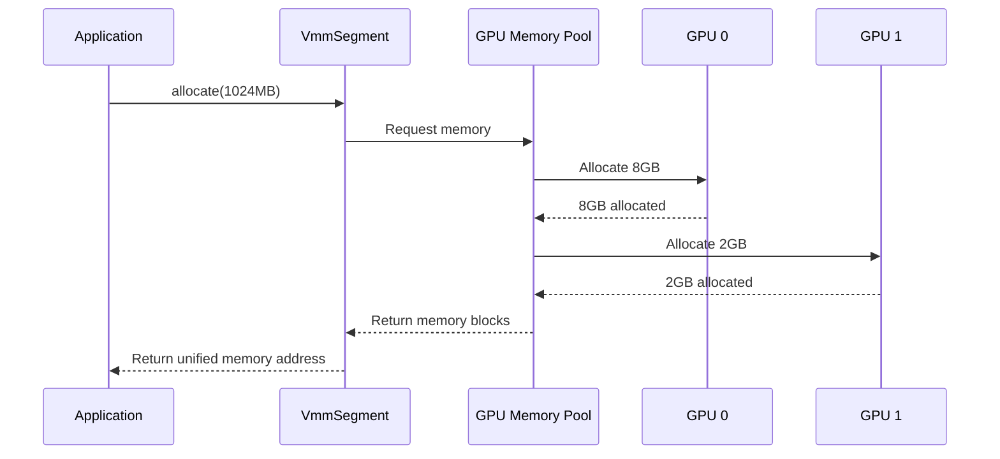

# Chapter 7: Memory Stitching Mechanism


<think>
Okay, I need to create a beginner-friendly tutorial chapter for the "Memory Stitching Mechanism" concept in the GMLake project. Let me start by understanding the user's requirements and the context provided.

The user provided a detailed structure for the tutorial chapters, and this is Chapter 7. The previous chapters cover the GPU Memory Pool, Caching Allocator, VMM, VmmSegment, and PhyBlock. The main goal is to explain the Memory Stitching Mechanism, its purpose, and how it solves memory management issues.

First, I'll need to outline the key points. The Memory Stitching Mechanism is a core feature that merges non-contiguous memory fragments into a single usable block. It's like a "memory puzzle solver" that rearranges fragmented pieces to create larger, contiguous memory regions, reducing waste and improving utilization. I should start with a high-level motivation using a concrete example, like a program needing more memory than available, leading to fragmentation, and how stitching helps.

Next, break down the key concepts. The Memory Stitching Mechanism combines non-contiguous memory blocks into a single logical block. I need to explain terms like memory fragmentation, stitching, and how it integrates with previous concepts like the GPU Memory Pool and VmmSegment. Use analogies, like a puzzle, to make it relatable.

I should explain how to use the Memory Stitching Mechanism to solve the use case. Provide a simple example, maybe a code snippet showing how memory is stitched. Ensure the code is minimal and under 20 lines. Use comments to simplify the code and explain each part.

Internal implementation: Use a sequence diagram to show how the Memory Stitching Mechanism works. Participants could include the application, VmmSegment, PhyBlock, and memory pool. The diagram should show the process of stitching non-contiguous blocks.

I need to reference other chapters, like the VmmSegment and PhyBlock, using proper Markdown links. Make sure to link to the correct filenames and chapter titles.

Use analogies, like a puzzle, to explain the Memory Stitching Mechanism. This helps beginners relate to the concept.

Finally, conclude the chapter by summarizing what was learned and transition to the next chapter on Memory Fragmentation Control. Make sure the tone is welcoming and easy to understand.

Now, structuring the Markdown content with these elements in mind. Making sure each section flows logically, uses examples, and keeps the language simple. Checking that code snippets are concise and explained clearly.
</think>

# Chapter 7: Memory Stitching Mechanism

## Why Memory Stitching Matters

Imagine you're trying to build a wall with bricks, but you have scattered bricks in different places. Instead of starting over, you can collect the scattered bricks and build a continuous wall. **Memory Stitching** is like this process—it combines scattered memory fragments into a single, usable block, making it easier to use memory efficiently.

**Problem**: When programs allocate and free memory, they often leave gaps (fragmentation) that make it hard to use large memory blocks. This wastes memory and slows down programs.

**Solution**: The Memory Stitching Mechanism acts like a "memory puzzle solver" that rearranges fragmented memory into larger, contiguous blocks. This reduces waste and makes memory more efficient.

## What is Memory Stitching?

Memory Stitching is a core feature that:
- **Combines non-contiguous memory fragments** into a single block
- **Reduces memory fragmentation** by reusing freed memory
- **Improves memory utilization** by creating larger contiguous regions

Think of it like a puzzle: instead of having scattered pieces, you combine them into a complete picture.

## How It Works in Practice

Let's say you need to allocate 10GB of memory, but your GPU only has 8GB available. Instead of failing, the Memory Stitching Mechanism:
1. Finds 8GB of memory on one GPU
2. Finds 2GB of memory on another GPU
3. Combines these into a single logical block
4. Returns a unified memory address to the program

This is like borrowing books from different shelves in a library and having them appear as a single collection on your desk.

## Key Concepts

### 1. Memory Fragmentation
This happens when memory is allocated and freed in a way that leaves small unusable gaps. For example, if you allocate 8GB and then free 2GB, you might have a 2GB gap that can't be used for a 2GB request.

### 2. Memory Stitching
The process of combining non-contiguous memory blocks into a single logical block. This allows programs to use memory as if it were contiguous, even if it's spread across multiple GPUs.

### 3. Virtual Memory Segments (VmmSegment)
These are logical blocks that can span multiple physical memory blocks. They act as containers for memory blocks, allowing efficient management and stitching.

## Using Memory Stitching

Here's a simple example of how memory is stitched:

```cpp
// Request 1024MB of memory
auto segment = vmm->allocate(1024);
void* ptr = segment->get_block();
```

**What happens**:
1. The VmmSegment checks the GPU Memory Pool for available memory.
2. It stitches non-contiguous blocks from different GPUs into a single logical block.
3. Returns a unified memory address to the program.

This is like asking the librarian for a book and having it appear on your desk, even if it was on multiple shelves.

## Internal Implementation

When you call `allocate()`, here's what happens:



This shows how the Memory Stitching Mechanism coordinates with the GPU Memory Pool to satisfy a memory request.

## Code Example

Here's a simplified version of how memory blocks are managed:

```cpp
struct PhyBlock {
    size_t size;       // Block size (e.g., 2MB)
    int device;        // Which GPU this block is on
    bool is_free;      // Is this block available?
    // ... other metadata ...
};

struct VmmSegment {
    std::vector<PhyBlock> phy_blocks;
    void* segment_ptr;
    size_t granul_size;
    int device_id;
    CUresult status;
    size_t free_blocks;
    size_t used_blocks;
    bool fused;
    bool released;
};
```

```cpp
// Allocate memory from the VmmSegment
void* allocate(size_t size) {
    // Find a suitable segment in the GPU Memory Pool
    for (auto& segment : memory_segments) {
        if (segment.free_blocks > 0 && segment.granul_size >= size) {
            // Stitch non-contiguous blocks if needed
            if (segment.phy_blocks.size() > 1) {
                stitch_blocks(segment);
            }
            return segment.segment_ptr;
        }
    }
    
    // If no segment found, request new memory from the GPU
    auto new_segment = request_new_segment(size);
    memory_segments.push_back(new_segment);
    return new_segment.segment_ptr;
}
```

This shows the basic logic of finding and allocating memory blocks through the Memory Stitching Mechanism.

## Advanced Features

GMLake's Memory Stitching Mechanism goes further by:
- **Stitching** memory blocks to create larger contiguous regions
- **LRU-based algorithms** to prioritize reuse of frequently used blocks
- **Multi-stream support** to manage memory across different computational streams

These features help reduce fragmentation and improve memory utilization.

## Next Steps

In the next chapter, we'll explore how to control memory fragmentation. [Chapter 8: Memory Fragmentation Control](08_memory_fragmentation_control_.md) will show how this system provides a unified view of memory across multiple GPUs.

Remember: Memory Stitching is like a puzzle solver that helps you manage your memory, making it easier to use large blocks without needing more physical memory.

---

Generated by [AI Codebase Knowledge Builder](https://github.com/The-Pocket/Tutorial-Codebase-Knowledge)