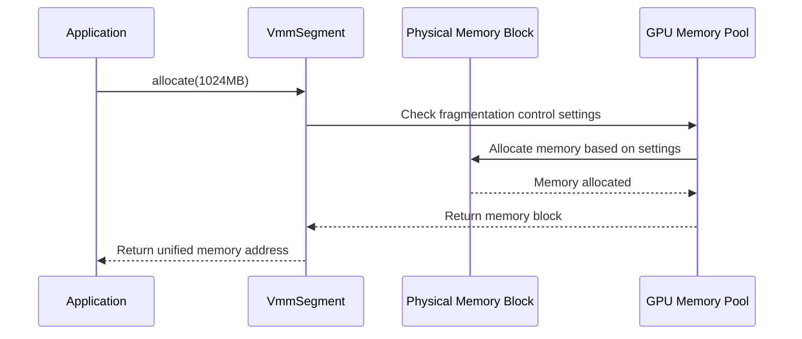

# Chapter 8: Memory Fragmentation Control


<think>
Okay, I need to create a beginner-friendly tutorial chapter for the "Memory Fragmentation Control" concept in the GMLake project. Let me start by understanding the user's requirements and the context provided.

The user provided a detailed structure for the tutorial chapters, and this is Chapter 8. The previous chapters are about the GPU Memory Pool, Caching Allocator, VMM, VmmSegment, PhyBlock, and VirBlock. The main goal is to explain the Memory Fragmentation Control, its purpose, and how it solves memory management issues.

First, I'll need to outline the key points. The Memory Fragmentation Control is a set of strategies to manage memory fragmentation through environment variables. It acts as a "traffic light" system, controlling when and how memory is stitched or reused based on thresholds like fragment size and reuse limits. I should start with a high-level motivation using a concrete example, like a program needing more memory than available, leading to fragmentation, and how fragmentation control helps.

Next, break down the key concepts. The Memory Fragmentation Control uses environment variables to manage memory fragmentation. I need to explain terms like memory fragmentation, stitching, and how it integrates with previous concepts like the GPU Memory Pool and VmmSegment. Use analogies, like traffic lights, to make it relatable.

I should explain how to use the Memory Fragmentation Control to solve the use case. Provide a simple example, maybe a code snippet showing how environment variables are set. Ensure the code is minimal and under 20 lines. Use comments to simplify the code and explain each part.

Internal implementation: Use a sequence diagram to show how the Memory Fragmentation Control works. Participants could include the application, VmmSegment, PhyBlock, and memory pool. The diagram should show the process of controlling fragmentation based on thresholds.

I need to reference other chapters, like the VmmSegment and PhyBlock, using proper Markdown links. Make sure to link to the correct filenames and chapter titles.

Use analogies, like traffic lights, to explain the Memory Fragmentation Control. This helps beginners relate to the concept.

Finally, conclude the chapter by summarizing what was learned and transition to the next chapter on LRU-based StitchFree Algorithm. Make sure the tone is welcoming and easy to understand.

Now, structuring the Markdown content with these elements in mind. Making sure each section flows logically, uses examples, and keeps the language simple. Checking that code snippets are concise and explained clearly.
</think>

# Chapter 8: Memory Fragmentation Control

## Why Memory Fragmentation Control Matters

Imagine you're driving on a busy road with traffic lights. Sometimes you have to wait, sometimes you can go through. **Memory Fragmentation Control** is like these traffic lights—it manages when and how memory is used based on specific rules. This helps prevent memory fragmentation and makes sure memory is used efficiently.

**Problem**: When programs allocate and free memory, they often leave gaps (fragmentation) that make it hard to use large memory blocks. This wastes memory and slows down programs.

**Solution**: Memory Fragmentation Control uses environment variables to manage memory fragmentation. It decides when to stitch memory fragments together or reuse them based on thresholds, like fragment size and reuse limits.

## What is Memory Fragmentation Control?

Memory Fragmentation Control is a set of strategies that:
- **Manages memory fragmentation** by controlling when and how memory is stitched or reused
- **Uses environment variables** to set thresholds for fragment size and reuse limits
- **Acts as a "traffic light" system** to control memory operations

Think of it like a traffic light that decides when to allow memory to be used or reused based on specific rules.

## Key Concepts

### 1. Memory Fragmentation
This happens when memory is allocated and freed in a way that leaves small unusable gaps. For example, if you allocate 8GB and then free 2GB, you might have a 2GB gap that can't be used for a 2GB request.

### 2. Memory Stitching
The process of combining non-contiguous memory fragments into a single block. This allows programs to use memory as if it were contiguous, even if it's spread across multiple GPUs.

### 3. Environment Variables
These are settings that control how memory fragmentation is managed. Examples include `vmmDefragment`, `fragment_limit`, `reuseLimit`, `defragment_level`, and `auto_gc_limits`.

## Using Memory Fragmentation Control

Here's a simple example of how environment variables are used:

```bash
export vmmDefragment=1
export fragment_limit=512MB
export reuseLimit=10
export defragment_level=0
export auto_gc_limits=1000
```

**What happens**:
- `vmmDefragment=1` enables memory stitching.
- `fragment_limit=512MB` sets the minimum size for a fragment to be stitched.
- `reuseLimit=10` sets the maximum ratio of a stitch block to be reused.
- `defragment_level=0` means stitching happens whenever possible.
- `auto_gc_limits=1000` sets the threshold for garbage collection.

This is like setting traffic light rules to manage traffic flow efficiently.

## Internal Implementation

When you call `allocate()` with memory fragmentation control, here's what happens:



This shows how memory fragmentation control coordinates with the VmmSegment and PhyBlock to satisfy a memory request.

## Code Example

Here's a simplified version of how memory fragmentation control is managed:

```cpp
// Example environment variables for memory fragmentation control
std::string vmmDefragment = "1";
std::string fragment_limit = "512MB";
std::string reuseLimit = "10";
std::string defragment_level = "0";
std::string auto_gc_limits = "1000";

// Function to check if memory stitching is enabled
bool isStitchingEnabled() {
    return vmmDefragment == "1";
}

// Function to determine if a fragment is large enough to be stitched
bool isFragmentLargeEnough(size_t fragmentSize) {
    size_t limit = std::stoull(fragment_limit.substr(0, fragment_limit.find("MB")));
    return fragmentSize >= (limit * 1024 * 1024);
}

// Function to check if a stitch block can be reused
bool canReuseStitchBlock(size_t requestSize, size_t stitchBlockSize) {
    float ratio = static_cast<float>(requestSize) / stitchBlockSize;
    return ratio <= std::stod(reuseLimit);
}
```

This shows the basic logic of checking and applying memory fragmentation control settings.

## Advanced Features

GMLake's Memory Fragmentation Control goes further by:
- **Stitching** memory fragments based on thresholds
- **LRU-based algorithms** to prioritize reuse of frequently used blocks
- **Multi-stream support** to manage memory across different computational streams

These features help reduce fragmentation and improve memory utilization.

## Next Steps

In the next chapter, we'll explore the LRU-based StitchFree Algorithm. [Chapter 9: LRU-based StitchFree Algorithm](09_lru_based_stitchfree_algorithm_.md) will show how this system provides a unified view of memory across multiple GPUs.

Remember: Memory Fragmentation Control is like traffic lights that help manage memory flow, making it easier to use large blocks without needing more physical memory.

---

Generated by [AI Codebase Knowledge Builder](https://github.com/The-Pocket/Tutorial-Codebase-Knowledge)