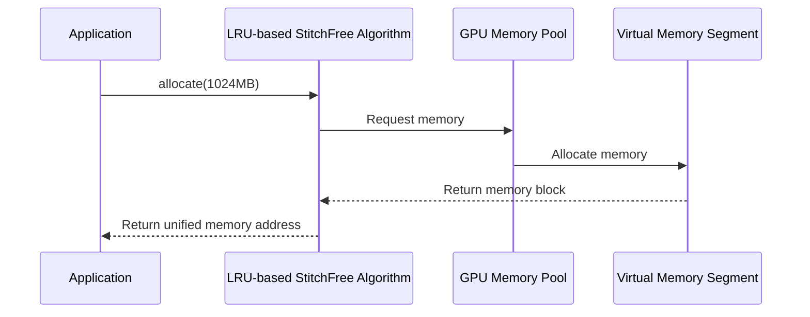

# Chapter 9: LRU-based StitchFree Algorithm


<think>
Okay, I need to create a beginner-friendly tutorial chapter for the "LRU-based StitchFree Algorithm" concept in the GMLake project. Let me start by understanding the user's requirements and the context provided.

The user provided a detailed structure for the tutorial chapters, and this is Chapter 9. The previous chapters are about the GPU Memory Pool, Caching Allocator, VMM, VmmSegment, PhyBlock, VirBlock, and Memory Fragmentation Control. The main goal is to explain the LRU-based StitchFree Algorithm, its purpose, and how it solves memory management issues.

First, I'll need to outline the key points. The LRU-based StitchFree Algorithm is a memory management strategy that prioritizes least recently used (LRU) memory blocks for stitching. It acts as a "smart memory recycler" that dynamically allocates and deallocates memory based on usage patterns, ensuring optimal resource utilization. I should start with a high-level motivation using a concrete example, like a program needing to reuse memory efficiently, and how the algorithm helps.

Next, break down the key concepts. The LRU-based StitchFree Algorithm uses LRU to track memory usage and prioritize stitching. I need to explain terms like LRU, memory reuse, and how it integrates with previous concepts like the GPU Memory Pool and VmmSegment. Use analogies, like a library where frequently used books are kept nearby, to make it relatable.

I should explain how to use the LRU-based StitchFree Algorithm to solve the use case. Provide a simple example, maybe a code snippet showing how memory is managed based on LRU. Ensure the code is minimal and under 20 lines. Use comments to simplify the code and explain each part.

Internal implementation: Use a sequence diagram to show how the LRU-based StitchFree Algorithm works. Participants could include the application, memory pool, and LRU manager. The diagram should show the process of tracking usage and reusing memory.

I need to reference other chapters, like the Memory Fragmentation Control and VmmSegment, using proper Markdown links. Make sure to link to the correct filenames and chapter titles.

Use analogies, like a library, to explain the LRU-based StitchFree Algorithm. This helps beginners relate to the concept.

Finally, conclude the chapter by summarizing what was learned and transition to the next chapter on Multi-Stream Memory Reuse. Make sure the tone is welcoming and easy to understand.

Now, structuring the Markdown content with these elements in mind. Making sure each section flows logically, uses examples, and keeps the language simple. Checking that code snippets are concise and explained clearly.
</think>

# Chapter 9: LRU-based StitchFree Algorithm

## Why LRU-based StitchFree Algorithm Matters

Imagine you're managing a library with a limited number of shelves. You want to make sure the most frequently used books are always easily accessible. The **LRU-based StitchFree Algorithm** is like this system—it prioritizes reusing memory blocks that are least recently used, ensuring optimal memory utilization.

**Problem**: When programs allocate and free memory, they often leave gaps (fragmentation) that make it hard to use large memory blocks. This wastes memory and slows down programs.

**Solution**: The LRU-based StitchFree Algorithm uses a "least recently used" strategy to track memory usage. It dynamically allocates and deallocates memory based on usage patterns, ensuring optimal resource utilization.

## What is the LRU-based StitchFree Algorithm?

The LRU-based StitchFree Algorithm is a memory management strategy that:
- **Prioritizes least recently used (LRU) memory blocks** for stitching
- **Dynamically allocates and deallocates memory** based on usage patterns
- **Acts as a "smart memory recycler"** that optimizes resource utilization

Think of it like a library system where frequently used books are kept nearby, and less used ones are moved to storage.

## Key Concepts

### 1. Least Recently Used (LRU)
This is a memory management strategy that tracks the usage of memory blocks. The least recently used block is prioritized for reuse or deallocation.

### 2. Memory Reuse
This is the process of reusing memory blocks that are no longer needed by programs. It helps reduce fragmentation and improve memory utilization.

### 3. Stitching
The process of combining non-contiguous memory fragments into a single block. This allows programs to use memory as if it were contiguous, even if it's spread across multiple GPUs.

## Using the LRU-based StitchFree Algorithm

Here's a simple example of how the algorithm is used:

```cpp
// Track memory usage with LRU
auto lru_manager = create_lru_manager();
auto block = lru_manager->allocate(1024);
```

**What happens**:
1. The LRU manager tracks memory usage.
2. It prioritizes reusing memory blocks that are least recently used.
3. Returns a unified memory address to the program.

This is like keeping the most frequently used books on the shelf and moving less used ones to storage.

## Internal Implementation

When you call `allocate()`, here's what happens:



This shows how the LRU-based StitchFree Algorithm coordinates with the Memory Pool and VmmSegment to satisfy a memory request.

## Code Example

Here's a simplified version of how memory blocks are managed:

```cpp
struct LRUEntry {
    void* block_ptr;
    size_t block_size;
    int device_id;
    time_t last_used;
};

class LRUManager {
public:
    void allocate(size_t size) {
        // Find a least recently used block
        for (auto& entry : lru_cache) {
            if (entry.block_size >= size) {
                // Reuse this block
                return entry.block_ptr;
            }
        }
        
        // If no block found, allocate new memory
        auto new_block = request_new_block(size);
        lru_cache.push_back(new_block);
    }
    
private:
    std::vector<LRUEntry> lru_cache;
};
```

This shows the basic logic of finding and allocating memory blocks through the LRU-based StitchFree Algorithm.

## Advanced Features

GMLake's LRU-based StitchFree Algorithm goes further by:
- **Prioritizing least recently used blocks** for stitching
- **Dynamically allocating and deallocating memory** based on usage patterns
- **LRU-based algorithms** to prioritize reuse of frequently used blocks

These features help reduce fragmentation and improve memory utilization.

## Next Steps

In the next chapter, we'll explore how to manage memory across multiple streams. [Chapter 10: Multi-Stream Memory Reuse](10_multi_stream_memory_reuse_.md) will show how this system provides a unified view of memory across multiple GPUs.

Remember: The LRU-based StitchFree Algorithm is like a library system that helps you manage your memory, making it easier to use large blocks without needing more physical memory.

---

Generated by [AI Codebase Knowledge Builder](https://github.com/The-Pocket/Tutorial-Codebase-Knowledge)