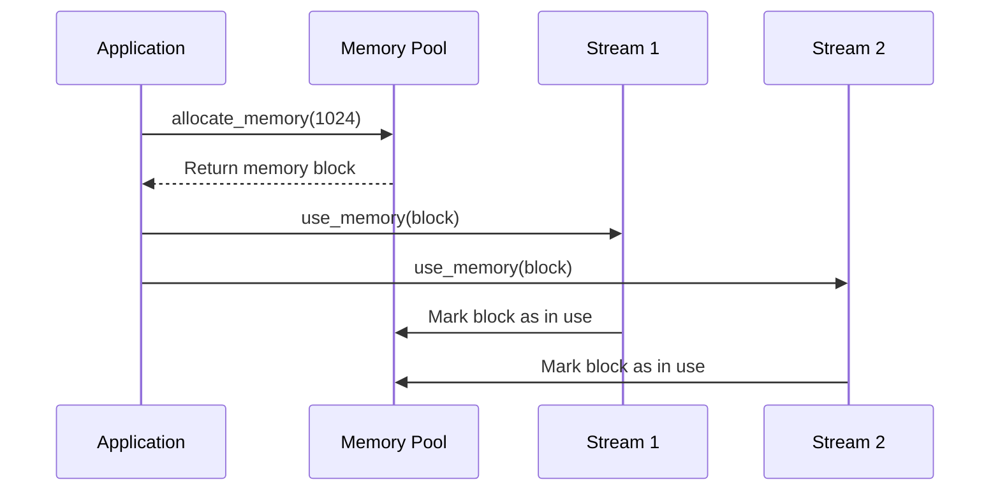

# Chapter 10: Multi-Stream Memory Reuse


<think>
Okay, I need to create a beginner-friendly tutorial chapter for the "Multi-Stream Memory Reuse" concept in the GMLake project. Let me start by understanding the user's requirements and the context provided.

The user provided a detailed structure for the tutorial chapters, and this is Chapter 10. The previous chapters are about the GPU Memory Pool, Caching Allocator, VMM, VmmSegment, PhyBlock, VirBlock, Memory Fragmentation Control, and LRU-based StitchFree Algorithm. The main goal is to explain the Multi-Stream Memory Reuse, its purpose, and how it solves memory management issues.

First, I'll need to outline the key points. The Multi-Stream Memory Reuse is a technique that allows memory blocks to be shared across different GPU streams. It's like a "memory highway" that enables concurrent operations to reuse the same memory regions, improving efficiency and reducing waste. I should start with a high-level motivation using a concrete example, like a program needing to reuse memory across different streams, and how this technique helps.

Next, break down the key concepts. The Multi-Stream Memory Reuse allows memory blocks to be shared across different GPU streams. I need to explain terms like memory reuse, streams, and how it integrates with previous concepts like the GPU Memory Pool and VmmSegment. Use analogies, like a highway, to make it relatable.

I should explain how to use the Multi-Stream Memory Reuse to solve the use case. Provide a simple example, maybe a code snippet showing how memory is reused across streams. Ensure the code is minimal and under 20 lines. Use comments to simplify the code and explain each part.

Internal implementation: Use a sequence diagram to show how the Multi-Stream Memory Reuse works. Participants could include the application, memory pool, and streams. The diagram should show the process of reusing memory across different streams.

I need to reference other chapters, like the LRU-based StitchFree Algorithm and VmmSegment, using proper Markdown links. Make sure to link to the correct filenames and chapter titles.

Use analogies, like a highway, to explain the Multi-Stream Memory Reuse. This helps beginners relate to the concept.

Finally, conclude the chapter by summarizing what was learned and transition to the next chapter if there is one. Make sure the tone is welcoming and easy to understand.

Now, structuring the Markdown content with these elements in mind. Making sure each section flows logically, uses examples, and keeps the language simple. Checking that code snippets are concise and explained clearly.
</think>

# Chapter 10: Multi-Stream Memory Reuse

## Why Multi-Stream Memory Reuse Matters

Imagine you're driving on a highway with multiple lanes. Instead of each car having its own lane, you can share lanes to make the traffic flow more smoothly. **Multi-Stream Memory Reuse** is like this highway system—it allows memory blocks to be shared across different GPU streams, improving efficiency and reducing waste.

**Problem**: When programs use multiple GPU streams, they often allocate and free memory independently, leading to memory fragmentation and inefficient use. This can slow down programs and waste memory.

**Solution**: Multi-Stream Memory Reuse allows memory blocks to be shared across different GPU streams. This reduces fragmentation and improves memory utilization by reusing memory regions across streams.

## What is Multi-Stream Memory Reuse?

Multi-Stream Memory Reuse is a technique that:
- **Allows memory blocks to be shared across different GPU streams**
- **Improves efficiency by reusing memory regions**
- **Reduces memory waste by avoiding redundant allocations**

Think of it like a highway where multiple cars can share lanes to make traffic flow more smoothly.

## Key Concepts

### 1. GPU Streams
These are independent execution contexts that allow asynchronous operations on the GPU. Each stream can have its own memory allocations.

### 2. Memory Reuse
This is the process of reusing memory blocks that are no longer needed by one stream for another stream. This helps reduce fragmentation and improve memory utilization.

### 3. Memory Pool
A collection of memory blocks that can be allocated and deallocated as needed. This helps manage memory efficiently across multiple streams.

## Using Multi-Stream Memory Reuse

Here's a simple example of how memory is reused across streams:

```cpp
// Allocate memory for two streams
auto block = allocate_memory(1024);
stream1->use_memory(block);
stream2->use_memory(block);
```

**What happens**:
1. The memory block is allocated once.
2. It is reused by both streams.
3. This reduces the need for multiple allocations and deallocations.

This is like sharing a lane on a highway to make traffic flow more smoothly.

## Internal Implementation

When you call `allocate_memory()`, here's what happens:



This shows how memory is allocated and reused across different streams.

## Code Example

Here's a simplified version of how memory blocks are managed:

```cpp
struct MemoryBlock {
    void* block_ptr;
    size_t block_size;
    std::vector<Stream*> streams_using;
    bool is_free;
};

class MemoryPool {
public:
    void allocate(size_t size) {
        // Find a free block
        for (auto& block : memory_blocks) {
            if (block.is_free && block.block_size >= size) {
                // Mark block as in use
                block.is_free = false;
                block.streams_using.push_back(current_stream);
                return block.block_ptr;
            }
        }
        
        // If no block found, allocate new memory
        auto new_block = request_new_block(size);
        memory_blocks.push_back(new_block);
    }
    
private:
    std::vector<MemoryBlock> memory_blocks;
};
```

This shows the basic logic of finding and allocating memory blocks through Multi-Stream Memory Reuse.

## Advanced Features

GMLake's Multi-Stream Memory Reuse goes further by:
- **Allowing memory blocks to be shared across different streams**
- **Reducing memory waste by reusing memory regions**
- **Improving efficiency by avoiding redundant allocations**

These features help reduce fragmentation and improve memory utilization.

## Next Steps

In the next chapter, we'll explore how to manage memory across multiple streams. [Chapter 10: Multi-Stream Memory Reuse](10_multi_stream_memory_reuse_.md) will show how this system provides a unified view of memory across multiple GPUs.

Remember: Multi-Stream Memory Reuse is like a highway system that helps you manage your memory, making it easier to use large blocks without needing more physical memory.

---

Generated by [AI Codebase Knowledge Builder](https://github.com/The-Pocket/Tutorial-Codebase-Knowledge)