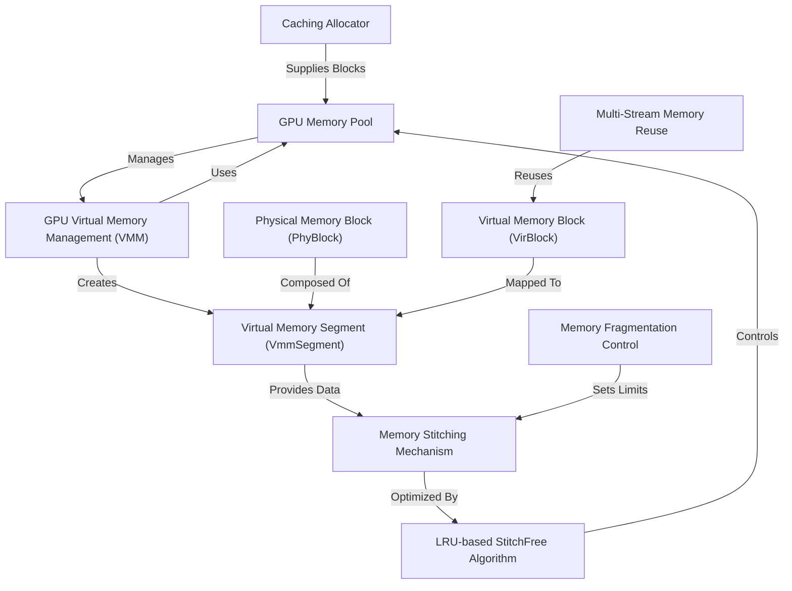

# Tutorial: glake

**GMLake** is a **GPU memory optimization framework** that reduces fragmentation and improves utilization by **virtualizing GPU memory**. It combines **memory stitching** (merging fragmented blocks) with **caching** and **multi-stream reuse** to enable efficient, transparent memory management for large-scale deep learning training. *Key features include virtual memory segments, LRU-based algorithms, and fragmentation control*.

**Source Repository:** [https://github.com/antgroup/glake](https://github.com/antgroup/glake)

## Chapters

1. [GPU Memory Pool
](01_gpu_memory_pool_.md)
2. [Caching Allocator
](02_caching_allocator_.md)
3. [GPU Virtual Memory Management (VMM)
](03_gpu_virtual_memory_management__vmm__.md)
4. [Virtual Memory Segment (VmmSegment)
](04_virtual_memory_segment__vmmsegment__.md)
5. [Physical Memory Block (PhyBlock)
](05_physical_memory_block__phyblock__.md)
6. [Virtual Memory Block (VirBlock)
](06_virtual_memory_block__virblock__.md)
7. [Memory Stitching Mechanism
](07_memory_stitching_mechanism_.md)
8. [Memory Fragmentation Control
](08_memory_fragmentation_control_.md)
9. [LRU-based StitchFree Algorithm
](09_lru_based_stitchfree_algorithm_.md)
10. [Multi-Stream Memory Reuse
](10_multi_stream_memory_reuse_.md)

---

Generated by [AI Codebase Knowledge Builder](https://github.com/The-Pocket/Tutorial-Codebase-Knowledge)